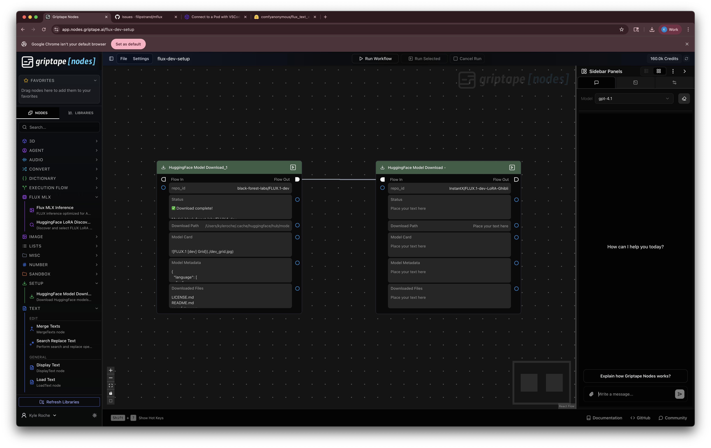
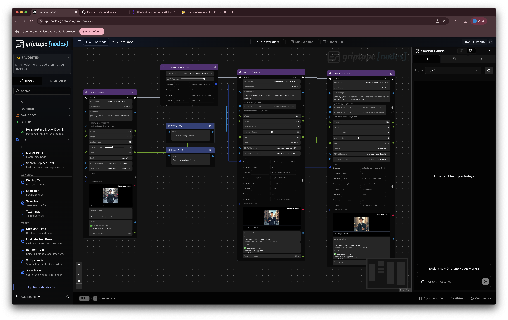

# Griptape Nodes: HuggingFace FLUX Library

A comprehensive Griptape Nodes library for running FLUX text-to-image models locally with optimized backends, LoRA support, and automated model setup.

## 🚀 **What This Library Provides**

- **FLUX.1-dev** and **FLUX.1-schnell** support with **LoRA integration**
- **Apple Silicon (MLX)** optimized inference with 10x+ performance boost
- **Automated model download** with real-time progress tracking
- **LoRA discovery and management** from HuggingFace cache
- **Dynamic model discovery** from HuggingFace cache
- **Custom T5/CLIP encoders** with safetensors support
- **Quantization options** (4-bit, 8-bit, none) for memory efficiency
- **Pre-quantized model detection** and automatic configuration
- **Template workflows** for quick setup and experimentation

## 📋 **Current Status**

| Backend | Status | Notes |
|---------|--------|-------|
| **MLX (Apple Silicon)** | ✅ **Working** | M1/M2/M3 Macs, work in progress |
| **CUDA (NVIDIA)** | ❌ **Not Working** | Coming in future release |

## 🛠 **Requirements**

### System Requirements
- **Apple Silicon Mac** (M1/M2/M3) for MLX backend
- **macOS** with Python 3.9+
- **HuggingFace account** for model downloads

### Dependencies
The library automatically installs:
- `mlx>=0.19.0` - Apple's MLX framework
- `mlx-lm>=0.18.0` - MLX language model support
- `git+https://github.com/griptape-ai/mflux.git@encoder-support` - Custom FLUX inference (our fork)
- `transformers>=4.53.2` - HuggingFace transformers
- `huggingface_hub>=0.24.0` - HuggingFace model hub

## 📦 **Installation**

### 1. Download the Library
```bash
# Navigate to your Griptape Nodes workspace
cd $(gtn config | grep workspace_directory | cut -d'"' -f4)

# Clone this repository
git clone https://github.com/griptape-ai/griptape-nodes-library-huggingface-flux.git
```

### 2. Register the Library
1. **Copy the JSON path**: Right-click on `huggingface_flux_mlx/griptape-nodes-library.json` and select "Copy Path"
2. **Open Griptape Nodes** and navigate to Settings
3. **Go to App Events tab** → **Libraries to Register** → **Add Item**
4. **Paste the absolute path** to `huggingface_flux_mlx/griptape-nodes-library.json`
5. **Restart Griptape Nodes** - the library will appear in the sidebar

> **⚠️ Important**: Use the JSON file from the **`huggingface_flux_mlx/`** subdirectory, not the root directory.

### 3. Download Your First Model

**Option A: Use the Setup Workflow (Recommended)**
1. Load the **"FLUX Model Setup"** template workflow from the library
2. Run the workflow to automatically download FLUX.1-dev and LoRA models
3. Get progress tracking and model information

**Option B: Manual Download**
```bash
# Install HuggingFace CLI if needed
pip install huggingface_hub

# Download FLUX.1-schnell (faster, 4 steps)
huggingface-cli download black-forest-labs/FLUX.1-schnell

# Or download FLUX.1-dev (higher quality, 15-50 steps)
huggingface-cli download black-forest-labs/FLUX.1-dev

# Download popular LoRAs
huggingface-cli download InstantX/FLUX.1-dev-LoRA-Ghibli
```

## 🎛 **Available Nodes**

### **FLUX Inference Nodes**
- **Flux MLX Inference** - Apple Silicon optimized inference using MLX framework
- **Flux CUDA Inference** - NVIDIA CUDA and CPU inference (coming soon)

### **Setup & Discovery Nodes**
- **HuggingFace Model Download** - Download models with real-time progress tracking
- **HuggingFace LoRA Discovery** - Discover and configure LoRA models from cache

### **Template Workflows**
- **FLUX Model Setup** - Download FLUX.1-dev and popular LoRAs
- **FLUX LoRA Generation** - Complete workflow showing LoRA-enhanced generation

## 🔍 **How Model Discovery Works**

The library **automatically scans your HuggingFace cache** and discovers:

### **FLUX Models**
- Searches `~/.cache/huggingface/hub/` for repositories matching FLUX patterns
- Filters out ControlNets, LoRAs, and encoder-only repositories
- Analyzes model structure (checks for transformer, VAE, scheduler components)

### **T5 Text Encoders**
- Finds T5 models: `google/t5-*`, `google/flan-t5-*`
- Discovers FLUX-specific encoders: `comfyanonymous/flux_text_encoders`
- Lists individual `.safetensors` files for granular selection
- Filters out unsupported `.bin` formats (MLX requires safetensors)

### **CLIP Text Encoders**
- Finds CLIP models: `openai/clip-*`, `laion/clip-*`
- Discovers FLUX-specific encoders from encoder repositories
- Lists individual `.safetensors` files
- Provides "None (use model default)" option

### **LoRA Models**
- Automatically discovers FLUX-compatible LoRA models from cache
- Filters by repository name patterns and file structure analysis
- Excludes base models, ControlNets, and non-LoRA repositories
- Provides metadata including download counts, descriptions, and gated status

## ⚙️ **Configuration**

### Customize Model Settings
Edit `huggingface_flux_mlx/flux_config.json` to customize defaults:

```json
{
  "global_defaults": {
    "default_steps": 15,
    "default_quantization": "4-bit",
    "default_width": 1024,
    "default_height": 1024,
    "default_guidance": 7.5,
    "quantization_options": ["none", "4-bit", "8-bit"],
    "default_t5_encoder": "None (use model default)",
    "default_clip_encoder": "None (use model default)"
  },
  "models": {
    "black-forest-labs/FLUX.1-dev": {
      "display_name": "FLUX.1 Dev",
      "mflux_name": "dev",
      "default_steps": 15,
      "max_steps": 50,
      "supports_guidance": true,
      "recommended_t5_encoder": "None (use model default)",
      "recommended_clip_encoder": "None (use model default)"
    },
    "black-forest-labs/FLUX.1-schnell": {
      "display_name": "FLUX.1 Schnell", 
      "mflux_name": "schnell",
      "default_steps": 4,
      "max_steps": 8,
      "supports_guidance": false,
      "default_guidance": 1.0
    },
    "Kijai/flux-fp8": {
      "display_name": "FLUX.1 Dev (FP8)",
      "mflux_name": "dev",
      "pre_quantized": "FP8",
      "pre_quantized_warning": "Model is pre-quantized as FP8. Runtime quantization disabled."
    }
  }
}
```

### **Configuration Options**

| Setting | Description | Options |
|---------|-------------|---------|
| `default_steps` | Default inference steps | Integer (1-50) |
| `default_quantization` | Memory optimization | `"none"`, `"4-bit"`, `"8-bit"` |
| `supports_guidance` | Classifier-free guidance | `true`/`false` |
| `pre_quantized` | Mark pre-quantized models | `"FP8"`, `"4-bit"`, etc. |
| `recommended_t5_encoder` | Suggested T5 for this model | Repository/file path |
| `recommended_clip_encoder` | Suggested CLIP for this model | Repository/file path |

## 🎛 **Node Parameters**

### **Model Selection**
- **Flux Model**: Auto-discovered from cache
- **Quantization**: Dynamic options based on model (pre-quantized models show "none" only)

### **Generation Settings**
- **Width/Height**: Free integer input (512-2048 recommended)
- **Inference Steps**: Interactive slider (1-8 for schnell, 1-50 for dev)
- **Guidance Scale**: Float (7.5 for dev, 1.0 for schnell)
- **Seed Control**: Fixed, Increment, Decrement, or Randomize
- **Seed**: Integer with actual seed output

### **Text Encoder Settings**
- **T5 Text Encoder**: Dropdown with discovered encoders + "None" option
- **CLIP Text Encoder**: Dropdown with discovered encoders + "None" option

Both encoder parameters support **input connections** for dynamic control.

### **LoRA Settings**
- **LoRA Models**: ParameterList supporting multiple LoRA connections
- **LoRA Strength**: Interactive slider (0.0-1.0) for effect intensity
- **LoRA Metadata**: Automatic display of model information and download stats

## 🚀 **Quick Start with Template Workflows**

### **1. FLUX Model Setup Workflow**
Download and configure FLUX models automatically:

1. Load the **"FLUX Model Setup"** template workflow
2. Run the workflow to download FLUX.1-dev and LoRA models
3. Monitor progress with real-time status updates



### **2. FLUX LoRA Generation Workflow**
Complete example showing LoRA-enhanced image generation:

1. Load the **"FLUX LoRA Generation"** template workflow
2. Observe the multi-prompt + LoRA setup
3. Run to generate enhanced images with Studio Ghibli style
4. Experiment with different prompts and LoRA strengths



## 🔮 **Upcoming Features**

- ✅ **Custom T5/CLIP Encoders** (Available now)
- ✅ **LoRA Support** (Available now)
- ✅ **Automated Model Download** (Available now)
- 🚧 **CUDA Backend** (Coming soon)
- 🚧 **ControlNet Support** (Planned)
- 🚧 **Img2Img Pipeline** (Planned)

## 💡 **Tips & Best Practices**

### **Getting Started**
1. **Start with the Setup Workflow** - Download models automatically with progress tracking
2. **Try the LoRA Example** - Load the template workflow to see LoRA integration
3. **Use Discovery Nodes** - Let the library find available models and LoRAs for you

### **Memory Optimization**
- Use **4-bit quantization** for lower memory usage (auto-detected for pre-quantized models)
- **Smaller resolutions** (512x512, 768x768) use less memory
- **Fewer steps** reduce memory requirements
- **LoRA models** add minimal memory overhead

### **Quality vs Speed**
- **FLUX.1-dev**: Higher quality, 15-50 steps, supports guidance, works great with LoRAs
- **FLUX.1-schnell**: Faster generation, 1-8 steps, no guidance needed, limited LoRA support

### **LoRA Usage**
- **Start with 1.0 strength** and adjust down for subtle effects
- **Multiple LoRAs** can be combined for complex styles
- **Popular LoRAs**: Ghibli style, realistic photography, anime styles
- **Check metadata** for download counts and community ratings

### **Custom Encoders**
- **"None" option**: Uses model's built-in encoders (recommended for most users)
- **Custom T5**: Try `google/t5-v1_1-large` for different text understanding
- **Custom CLIP**: Experiment with different CLIP variants for style control

### **Workflow Design**
- **Connect seed outputs** between nodes for consistent generation series
- **Use ParameterList** for multiple prompts and LoRAs
- **Monitor status outputs** for real-time generation feedback

## 🐛 **Troubleshooting**

### **"No models found"**
- Use the **Setup Workflow** to download models automatically
- Or manually: `huggingface-cli download <model-name>`
- Check `~/.cache/huggingface/hub/` for model files

### **"No LoRAs found"**
- Download LoRAs: `huggingface-cli download InstantX/FLUX.1-dev-LoRA-Ghibli`
- Refresh the LoRA Discovery node
- Check that LoRA repositories have `.safetensors` files

### **Memory issues**
- Enable 4-bit or 8-bit quantization (auto-selected for compatible models)
- Reduce image resolution
- Use fewer inference steps
- LoRAs use minimal additional memory

### **LoRA not working**
- Ensure LoRA is compatible with your base model (FLUX.1-dev vs schnell)
- Check LoRA strength (try 1.0 first, then adjust)
- Verify LoRA is properly connected to the ParameterList

### **Slider/UI issues**
- Steps slider range automatically adjusts based on model (1-8 for schnell, 1-50 for dev)
- LoRA strength slider ranges from 0.0-1.0
- If sliders don't appear, restart Griptape Nodes

### **MLX not available**
- Ensure you're on Apple Silicon (M1/M2/M3)
- Install MLX: `pip install mlx`

## 📞 **Support**

- **Issues**: Open GitHub issues for bugs/feature requests
- **Discussions**: Use GitHub discussions for questions
- **Documentation**: Check `node-development-guide-v2.md` for development info

---

**Made with ❤️ for the Griptape Nodes community**
